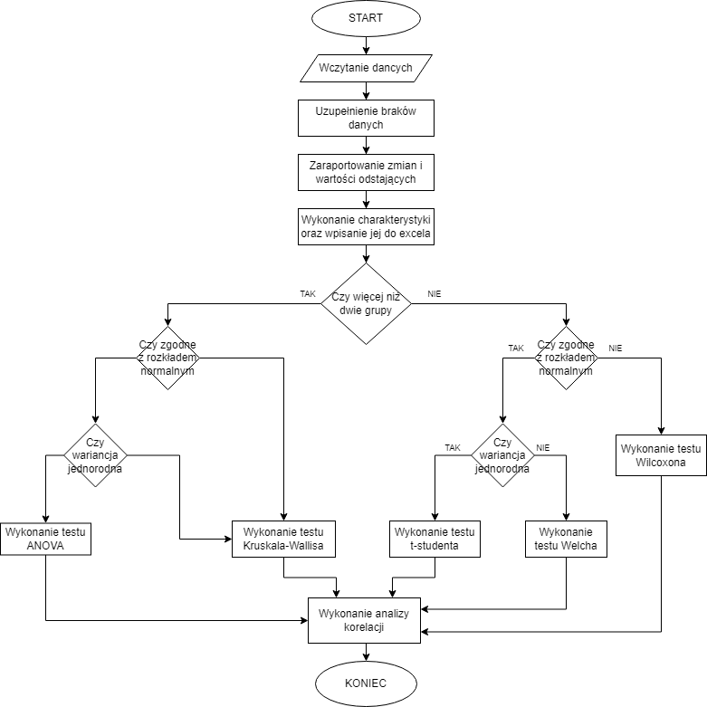

<h1 align="center"> projekt RPiS 2022 </h1>
Mikołaj Ewald, 469494

&nbsp;<br>

## manual uruchomienia programu

Program uruchamiamy poprzez wywołanie odpowiedniej komendy w terminalu/konsoli. W celu uruchomienia skryptu na Windowsie składnia komendy wygląda następująco 

```
"ścieżka do R.exe" CMD BATCH --vanilla "--args ścieżka do pliku csv" script.r
```
W przpypadku uruchomienia pliku na Linuxie musimy najpierw ustawić odpowiednią ścieżkę do R, a następnie możemy wywołać polecenie uruchomienia skryptu:
```
R CMD BATCH --vanilla "--args ścieżka do pliku csv" script.r output.txt
```
Co ważne dane w pliku .csv muszą być oddzielone ";". W przeciwnym przypadku program nie zadziała poprawnie. 

Nie jest wymagane instalowanie żadnych dodatkowych bibliotek, ponieważ skrypt wykona to automatycznie.

## sprawozdanie
Schemat blokowy przedstawiający działanie programu wygląda następująco: 
<br>

</imhg>

Pierwszym krokiem po wszytaniu danych jest uzupełnienie braków danych w podanym przez użytkownika arkuszu. Wszystkie wprowadzone zmiany są raportowane do pliku *raport.txt*. <br>
Braki danych wypisane są w następujący sposób:
```
Wpisanie nowa_wartosc w nr_wiersza, nr_kolumny (nazwa grupy, nazwa kolumny)
```
Wartości odstające są wyszukiwane na podstawie wykresu pudełkowego, a dokładniej są to wartości, których położenie na wykresie znajduje się daleko od prostokątu (pudełka). W pliku są zaroportowane w nastęującej formie:
```
Wartośći w kolumnie nazwa_kolumny: wartosci
```
Wartości są wypisane w jednej linii, a pomiędzy nimi znajduje się znak spacji.
<br><br>

Kolejnym etapem działania programu jest wykonanie charakterystyki dla wprowadzonych danych. W tym celu skrypt oblicza średnią arytmetyczną, medianę oraz odchylenie standardowe. Na średnią arytmetyczną oraz medianę nie mają wpływu wartości uznane jako skrajne. Charakterystyka dancych jest zapisywana w pliku *charakterystyka.xlsx*. Przykład charakterystyki dla grupy **CHOR1**:

| group\_name | wiek  | hsCRP | ERY  | PLT    | HGB   | HCT  | MCHC  | MON  | LEU   |
| ----------- | ----- | ----- | ---- | ------ | ----- | ---- | ----- | ---- | ----- |
| CHOR1 sr    | 29,56 | 6,1   | 5,36 | 225,28 | 12,41 | 0,36 | 35,13 | 0,86 | 12,02 |
| CHOR1 os    | 5,88  | 8,82  | 5,77 | 54,22  | 1,19  | 0,03 | 0,88  | 0,29 | 2,58  |
| CHOR1 med   | 29    | 3,97  | 4,2  | 217    | 12,4  | 0,36 | 35,05 | 0,76 | 11,66 |

Skrót sr oznacza wartość średnią, os oznacza odchylenie standardowe, a med oznacza medianę. Każda grupa z danych podanych przez użytkownika posiada swoją charakterystykę w osobnym arkuszu w pliku wynikowym. 

W celu rozpoczęcia analizy porównawczej między grupami, należy wpierw określić zgodność z rozkładem normalnym oraz homogeniczność wariancji badanych danych.

W celu określenia zgodności z rozkładem normalnym program wykorzystuje metodę o nazwie *shapiro.test*, której działanie zostało oparte o [test Shapiro-Wilka](https://pl.wikipedia.org/wiki/Test_Shapiro-Wilka). Po wykonaniu analizy program wykonuje ich graficzną reprezentację przy użyciu funkcji *ggdensity()*. Wykresy zapisują się w folderu */wykresy/rozklad*. Nazwa każdego wykresu odnosi się do nazwy kolumny, której dane są przedstawione na wykresie. Każda grupa jest przedstawiona jako osobny kolor. Wartości zgodności są zapisywane w data.frame w celu późniejszego użycia. 

Homogeniczność wariancji jest obliczana przy użyciu *leveneTest*, którego działanie zostało oparte na [teście Levene'a jednorodności wariancji](https://pl.wikipedia.org/wiki/Test_Levene%E2%80%99a_jednorodno%C5%9Bci_wariancji). Po obliczeniu wartości dane są zaokrąglane do trzech miejsc po przecinku, a następnie zapisywane w data.frame.

Analiza porównawcza zachodzi zgodnie z schematem blokowym. Rozpoczyna się od sprawdzenia ilości porównywanych grup. Jeżeli w zestawie są dwie grupy rozważamy przeprowadzenie testów:

- test **t-Studenta**: jeżeli dane mają zgodność z rozkładem normalnym oraz wariancja jest jednorodna.
- test **Welcha**: jeżeli dane mają zgodność z rozkładem normalnym, ale wariancja nie jest jednorodna.
- test **Wilcoxona**: jeżeli dane nie są zgodne z rozkładem normalnym.

W przypadku więcej niż dwóch grup rozważane są następujące testy:
